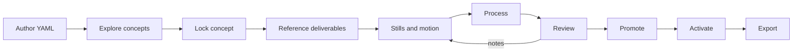

# Brainforge

A local, single-user asset-production workbench for 2D games. You describe an asset in YAML, an AI agent (or you) generates candidates through your own ComfyUI, you review and approve them in a web UI, and Brainforge promotes, activates and exports a coherent, versioned set of PNGs, atlases and (optionally) Godot 4 resources into your game.

Brainforge never generates art by itself. All image and motion generation goes through a ComfyUI server you run (Krea 2 for stills, Wan 2.2 for motion). Brainforge plans, tracks, reviews, processes, versions and exports the results.

- Everything lives inside your game directory, under `brainforge/`. Move or snapshot the project and the history goes with it.
- Humans decide: concept lock, approvals that policy reserves for humans, promotion, activation. Agents author YAML, plan, generate under a budget, review, and respond to notes.
- Full requirements are in [docs/SPEC.md](docs/SPEC.md). Requirement coverage and known gaps are in [docs/COVERAGE.md](docs/COVERAGE.md). A recorded end-to-end run is in [docs/FIRST-CHARACTER-RUN.md](docs/FIRST-CHARACTER-RUN.md).

## Requirements

|Need|Notes|
|---|---|
|[Bun](https://bun.sh) 1.3.14|Runtime, package manager, test runner. Pinned in `package.json` and `.bun-version`. No Node.js needed.|
|ComfyUI reachable over HTTP|Tested with 0.36.0. Needs the Krea 2 Turbo, Wan 2.2 i2v and BiRefNet models plus the Krea2 identity-edit nodes. Check with `workflow.preflight`.|
|FFmpeg / ffprobe (optional)|Only for video-producing workflows. The bundled Wan workflows save PNG frame sequences.|
|Godot 4.3+ (optional)|Only to open the `godot4` export. Not required for generic export.|

macOS is the development target. Stable export paths rely on relative directory symlinks.

## Install and run

```sh
bun install
bun run server        # API + built web UI on http://127.0.0.1:3210
```

Development with hot reload (server on 3210, Vite on 5173, proxying `/api`):

```sh
bun run dev
```

Production build and served UI:

```sh
bun run build
bun run server
```

Open <http://127.0.0.1:3210>. The server only accepts requests whose `Host` is loopback; browser requests from the UI origin are treated as the human.

### Point it at ComfyUI

Set the URL once in the UI (Settings → ComfyUI connection). It is a machine setting, never stored in the project. For scripts and the feasibility CLI you can use `BF_COMFY_URL=http://127.0.0.1:8188`.

Loopback does not mean free or local compute. The ComfyUI server may be a remote GPU behind a tunnel. Workflows list their compute location and cost description, and generation only runs under a human-granted budget.

#### Four-view construction sheets

Character templates opt their construction sheet into `krea2-construction-sheet` (or
`krea2-construction-sheet-opaque` for opaque output). Other stills and motion retain their
family workflows. Existing sheets are unchanged unless their deliverable opts in:

```yaml
overrides:
  workflows:
    variation: krea2-construction-sheet
    variationOpaque: krea2-construction-sheet-opaque
```

Install `Krea2_Character_Design_4-View_V1.safetensors` in the ComfyUI host's `models/loras/`
from [Civitai version 3325168](https://civitai.com/models/2937321?modelVersionId=3325168)
(authenticated download may be required). Expected SHA256:
`2a77c05e1a3e1be7c02ccb74c4d750198d968c942526acef5d8da035f93a54ce`.
The workflow keeps the identity-edit adapter and stacks the four-view adapter at weight 1,
with 8 sampling steps and CFG 1.

Use front, profile and rear full-body regions followed by a facial close-up; the starter
canvas is 2048×1024 with four 512×1024 regions. Prompt each region's framing explicitly.
The crop rectangles are fixed, not detected: inspect the actual output before approving.
For a baseline comparison, set `variation: krea2-variation` (or
`variationOpaque: krea2-variation-opaque`) on that same deliverable.
Run `workflow.preflight` before generating.
Reference-sheet prompts use the locked reference for identity/style and include only the
sheet instruction, region layout, identity-preservation instruction and per-run corrections.
They do not re-send concept descriptions, identity prose, project art direction or palettes.

Live Cortex comparison (2026-10-01): both workflows completed at 2048×1024 with the same
prompt/reference and different seeds. The LoRA (`cand-030c259934`, seed 5494996) produced
three body views plus a large face close-up; the baseline (`cand-93107344a6`, seed 891047626)
produced five full-body figures and no close-up. This is one pair, not a reliability benchmark.
The LoRA's front remains three-quarter, and its wider face panel means the four equal-width
crops cut across figures. Neither candidate was approved. Crop alignment and strict front
orientation remain review requirements; the opaque sheet workflow is not live-tested.

The optional `krea2-quadview` recipe uses `QuadView_krea2_v1.safetensors` alone (not stacked
with identity-edit), weight 1, 10 Euler/simple steps, CFG 1, reference strength 1 and a
1536×1024 canvas. Its trigger/layout is face close-up first, then front/side/back full bodies;
use matching deliverable regions rather than the face-last construction-sheet layout.
The initial Cortex test (`cand-d7fda35b73`, seed 1541969294) completed with that layout but
added ears/eyebrows and changed proportions. Inspection of ComfyUI history confirmed the
correct adapter/reference wiring, but also found concept prose appended to the edit prompt.
That prompt-composition bug is corrected for all reference sheets; the initial result is not
a clean test of QuadView's reference fidelity. The recipe remains optional and unapproved.
The corrected run (`cand-5263b2959d`, seed 455435835) removed the added ears/eyebrows and
produced a square-on front body. ComfyUI history showed only the prompt and seed changed
from the initial run; proportions and crops still require review. No candidate was approved
and the default workflow was not changed.

Workflow override keys are `still`, `variation`, `motion`, and their `Opaque` counterparts.
They inherit project → family → asset → deliverable settings; alpha selects the exact key.
Overrides cannot enable a generation stage the asset family does not support.

### Start a project

In your game repo (the **game root**):

1. In the UI, choose **Open or create a project…** in the project menu (top left), then open or preview creation in your game directory. An agent can also call `project.init` (previews first, `confirm: true` to write).
2. Brainforge creates `brainforge/` (and `brainforge/.gdignore`). It never touches the rest of your game.
3. Author `project.yaml`, a style, and your first asset (see below).

### The web app

|Place|Use it for|
|---|---|
|**Home**|What needs you next (one ranked list, one action each), how close the game is, and every asset.|
|**Asset sheet**|One asset as a sheet of its deliverables. Each cell shows its art, what's waiting for you, or what it's blocked on. The **Definition** and **Versions** tabs hold the spec, the references and the immutable versions.|
|**Room**|One deliverable: judge candidates on the stage (backgrounds, zoom, playback, compare), add notes tied to exact outputs and frames, and decide. An empty cell's room plans budgeted generation instead.|
|**Review**|The room in queue mode across assets ("1 of 4 waiting", J/K to move).|
|**Releases**|What's in the game. Promotion, activation and export remain separate, explicit actions.|
|**Activity** and **Settings**|Behind the top-bar status and the gear: jobs, decisions and preferences; project, art direction, connection and agent setup.|

**⌘K** jumps to any asset or deliverable. Back from a room returns to the same cell on the sheet. Appearance follows the system or an explicit light/dark choice; the checker, light and dark artwork backgrounds are independent of it. Design notes are in [docs/WEB-UI-REDESIGN.md](docs/WEB-UI-REDESIGN.md).

## Using it with an agent (CLI)

Agents use the CLI only, guided by the skill in [skills/brainforge/](skills/brainforge/SKILL.md) (every operation, the YAML formats, the operating protocol). Install a `brainforge` wrapper once so it is on PATH in any game directory (writes `~/.local/bin/brainforge` pointing at this checkout; rerun after moving it):

```sh
bun run install-cli
```

Then, from inside the game directory (the project is found by walking up to the first `brainforge/project.yaml`; server URL from `BF_SERVER_URL`, default `http://127.0.0.1:3210`):

```sh
brainforge --list
brainforge spec.read --input '{"path":"brainforge/assets/cortex/asset.yaml"}'
```

Inside the checkout, use `bun run bf -- <op> --input '<json>'` instead. Other flags: `--input-file <path>`, `--input -` (stdin), `--project <dir>`, `--request-id <id>`, `--timeout <s>`, `<op> --help`. stdout is one JSON envelope. When a result carries `visuals`, the CLI saves a model-sized copy of each image under `$TMPDIR/brainforge-visuals-XXXXXX/` and lists the paths in `visualFiles`; open them with your image reader. Agents author YAML by editing the files directly, then check `problems` via `spec.read`. More in [skills/brainforge/references/cli-setup.md](skills/brainforge/references/cli-setup.md).

## Project layout

```text
<game>/
  brainforge/
    project.yaml                     # sole entry point: art direction, defaults, requirements, policy, export
    styles/<style-id>.yaml
    references/<id>/<file>           # shared reference images
    assets/<asset-id>/
      asset.yaml                     # one asset: family, identity, deliverables
      references/                    # asset-specific references
      work/                          # runs, candidates, reviews (managed)
      versions/<version-id>/         # immutable promoted versions (managed)
    .state/project.sqlite            # authoritative managed records (managed)
    .gdignore
  assets/brainforge/                 # configured export destination
    current -> .releases/<export-id> # atomically switched
```

You and agents author the YAML and references. Brainforge manages `work/`, `versions/` and `.state/`. They are durable project data, not caches: back up or move the whole `brainforge/` tree, or use `project.snapshot`, never copy an open database by hand.

## How the pipeline works

Every asset moves through the same stages. Each stage is gated: nothing advances on its own, and nothing is approved just because it was generated.



### Expected steps

1. **Author.** Write `project.yaml` (art direction, sizing, fps, required assets, review policy), a style, and `assets/<id>/asset.yaml` (family, description, identity, deliverables). The YAML text is the image prompt: describe the picture in concrete, positive phrasing. Validate with `spec.validate` before saving; saves use `expectedHash` so concurrent edits surface as a conflict instead of overwriting.
2. **Explore.** Plan a concept batch (`generation.plan` shows the exact prompt, counts and budget). A human grants a budget; then `generation.start`. Compare candidates, favorite, annotate with whole-image, pin or rectangle notes, and request revisions. Variations reuse a selected candidate as an identity reference.
3. **Lock.** A human locks one concept output. This creates a **branch** and unlocks production. A lock is a choice, not a production version.
4. **Reference deliverables.** Only what the family needs. A character gets a front/profile/rear construction sheet and pose guides; a static prop gets none. Each is generated, reviewed and approved before anything depends on it.
5. **Produce.** Generate the required stills and, for animations, Wan clips bound to approved start/end guides. Motion produces **source frames**; those are not yet the deliverable.
6. **Process.** `processing.plan` then `processing.start` crops, scales (one scale anchor per character), resamples to the playback fps, sets pivots and packs atlases. This creates a new, unapproved processed output. Reprocessing never overwrites originals. Corrected frames can round-trip through external editing via `candidate.export-cleanup` / `candidate.import-cleanup`.
7. **Review.** Look at the processed result (light, dark and checkerboard backgrounds, frame stepping, actual atlas playback). Approve, reject, escalate or leave notes. Required notes block completion until resolved or waived by an authorized reviewer. Policy per step decides who may approve: `human`, `agent`, or `agent_with_escalation` (default for production review).
8. **Promote.** `promotion.plan` lists every blocker for the whole bundle (missing deliverable, unresolved note, stale approval, requirements changed). `promotion.start` creates an immutable version. Promotion does not change what is active.
9. **Activate.** A separate, human step selects which promoted version is active. Earlier versions can be restored; activating one that no longer matches current requirements needs an explicit acknowledgement.
10. **Export.** `export.plan` then `export.start` publishes active versions to `assets/brainforge/current/...` as `generic` (PNGs, atlases, JSON metadata) or `godot4` (adds SpriteFrames, AtlasTexture, StyleBoxTexture, TileSet). The switch is one atomic symlink, so the game never sees a half-written export, and files you own in the destination are never overwritten.

Throughout, `project.completeness` answers "what is left?" and `asset.impact` shows which steps need reassessment after a YAML edit. Editing an asset marks only affected steps; it never regenerates or touches a promoted version.

### Humans and agents

|Action|Who|
|---|---|
|Author specs, plan, generate under budget, annotate, respond to revisions|Agent or human|
|Grant budgets, confirm policy changes, set connection, propose-confirm preferences|Human only|
|Lock concept, approve, promote, activate|Per policy; the default requires a human for lock, promotion and activation|

Identity comes from the transport: the browser UI is the human, CLI calls are agents (`x-brainforge-agent: cli`). This guards against accidents and cross-site requests on a trusted local machine; it is not a sandbox against hostile local code.

### Asset families

`character`, `creature`, `item`, `equipment`, `prop`, `environment`, `background`, `tile`, `ui`, `icon`, `effect`. All share the pipeline above; families differ in which deliverable kinds, alpha behaviour and motion they allow. See `family.list` and [skills/brainforge/references/families.md](skills/brainforge/references/families.md).

## Repository layout

|Path|Purpose|
|---|---|
|`apps/server`|Bun + Hono API, durable scheduler, SSE, serves the web UI|
|`apps/web`|React + Vite review workbench|
|`apps/cli`|Operation CLI (`bun run bf`)|
|`packages/contracts`|Zod schemas and operation registry (browser-safe)|
|`packages/core`|Operation handlers, pipeline planning, review, branching, promotion|
|`packages/storage`|Project paths, SQLite schema and migrations, atomic file helpers|
|`packages/comfy`|ComfyUI client, workflow descriptors, preflight|
|`packages/media`|Decode, framing, processing, resampling, atlas packing|
|`packages/export`|Generic and Godot 4 export, atomic publication|
|`skills/brainforge`|Agent skill and YAML references|
|`scripts`|`feasibility`, `recovery-smoke`, `audit-operations`|

## Scripts

|Command|What it does|
|---|---|
|`bun run server`|Start the server (API + UI) on 3210|
|`bun run dev`|Server and Vite dev server|
|`bun run build`|Build all workspaces|
|`bun run test`|All package tests (`bun:test`; no live ComfyUI needed)|
|`bun run typecheck`|`tsc` across workspaces|
|`bun run bf -- <operation> ...`|Call any operation from the CLI|
|`bun run install-cli`|Install the `brainforge` wrapper in `~/.local/bin` for this checkout|
|`bun run audit`|Check every operation has a handler, CLI `--help`, a skill mention and a test reference|
|`bun run recovery-smoke -- --source-project <dir> --scenario all`|Fault-injection scenarios on a temp copy: restart mid-collection, partial download, promotion and export failure|
|`bun run feasibility -- --project <dir> --phase brief --plan`|Bounded art-proof harness used before the app existed|

## Testing

```sh
bun run typecheck
bun run test
```

Tests use a fake ComfyUI protocol server and synthetic media, so they prove transport, state and file behaviour, not art quality. Real-GPU runs are described in [docs/FIRST-CHARACTER-RUN.md](docs/FIRST-CHARACTER-RUN.md). Godot export compatibility is checked with `packages/export/scripts/godot-verify*.ts` against a local Godot 4.

## Status

Feature-complete against the spec, with gaps listed honestly in [docs/COVERAGE.md](docs/COVERAGE.md): video frame extraction (ffmpeg) is not implemented, the opaque Wan workflow has not run on a real ComfyUI, and some live behaviours are verified only against the fake server.

## License

[MIT](LICENSE)
